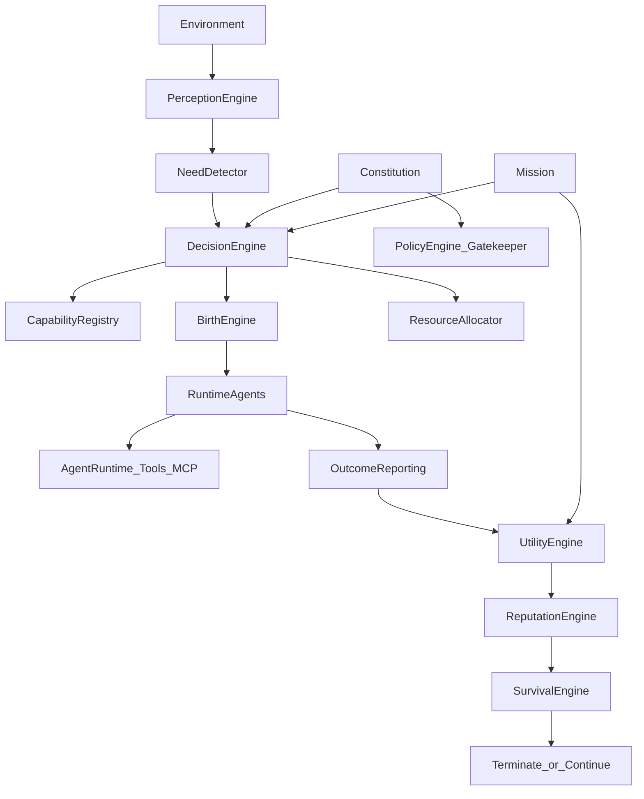
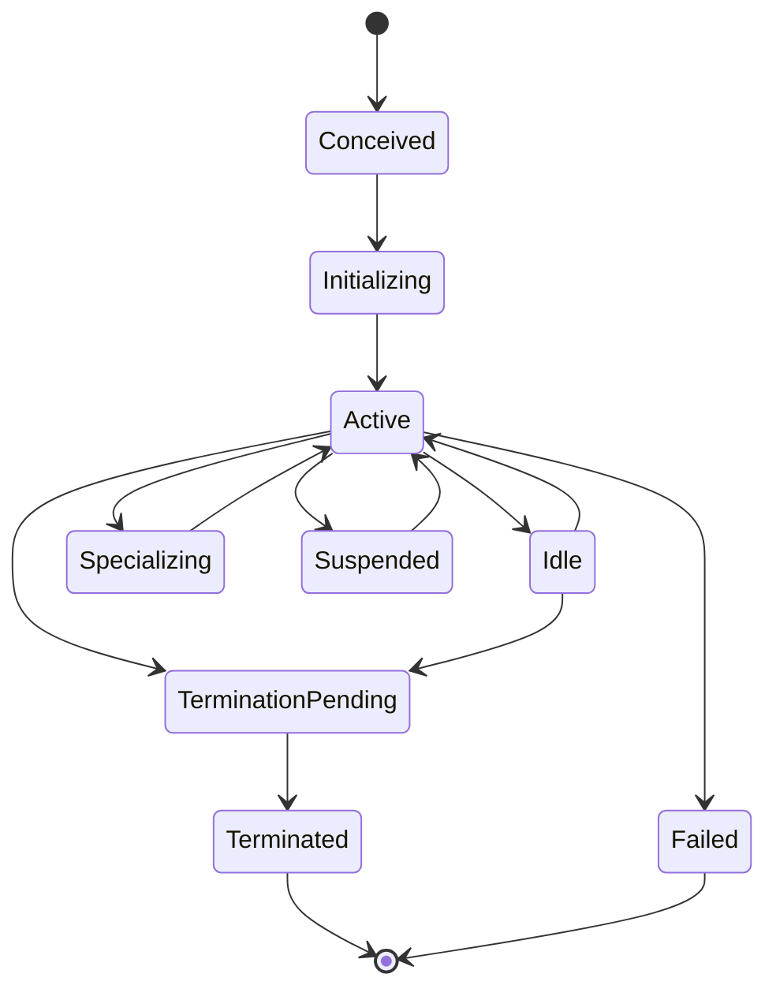
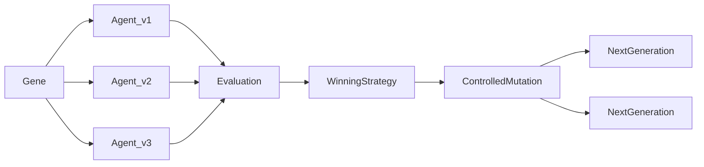

# Organism Runtime Architecture

## Philosophy

> Developers deploy a goal, not an agent topology.

`@hazeljs/organism` is a **control plane** on top of `@hazeljs/agent` (ADR-001). It does not replace `AgentRuntime`, tool execution, durable runs, or gatekeeper.

## Runtime architecture



## Agent lifecycle



## Evolution (Phase 3 preview)



## Package boundary

```
@hazeljs/organism → @hazeljs/agent → @hazeljs/core
                 ↘ optional: agent-gatekeeper, observability
```

## LLM boundary

Deterministic code handles: resource accounting, permissions, reputation math, lifecycle state, policy enforcement, spawn/reproduction limits, genealogy, mutation audits, generation scoring, event persistence.

Models (optional, later) may interpret ambiguous signals or propose specializations. Phase 1–3 need detection, spawn, reproduction, mutation, and generation evaluation are fully deterministic.

## Phase 2–4 additions

- **Reproduction:** `ReproductionEngine` + `GenealogyManager` — parent→child with inheritance policy, permission subset rules, resource transfer, depth/child limits
- **Evolution:** `MutationEngine` + `EvolutionEngine` + `GenerationManager` — constrained config mutation, population scoring, strategy promotion
- **Economy:** `UtilityForecaster` + `MarketEngine` — opportunity cost, sealed-bid clearing, peer negotiation
